# 🚗차곡차곡🚗

## 🎞 프로젝트 진행기간

진행기간 2024.01.08 ~ 2024.02.16<br>

SSAFY 10기 공통 프로젝트<br>

## 서비스 소개

> 주차장에서 돌고 도는 당신을 위한 자동 주차 배정 시스템, 🚗차곡차곡🚗<br>
> 혼잡한 주차장 내부에서 발생하는 문제의 근본적 해결을 위한 주차장 자리배정 시스템

## 💻주요기능

### 주차장 내부

- 장애 여부를 선택하고, 취향에 따라서 자리를 배정해 줍니다.
- 새로운 장비를 구매하여 설치하는 것이 아닌, 기존의 cctv를 활용하여 이미지에서 자동차 번호판을 읽어냅니다.
- AI를 활용하여 차량의 번호판을 인식합니다.
- 각 구역에 자리를 배정받은 차량이 진입하면 cctv가 차량을 감지하고, 자리의 차단바를 해제시킵니다.

### 관리자

- 실시간으로 주차장에 자리가 얼마나 남았는지, 어느 구역이 많이 비는지 확인할 수 있습니다.
- 각 자리에 설치된 센서를 이용하여, 문제가 발생했을 때, 자동으로 관리자에게 신고됩니다.

## 🖼서비스 화면

### kiosk

|                               메인                               |                               차량인식                                |                                자리선택                                |                            주차자리 배정                            |
| :--------------------------------------------------------------: | :-------------------------------------------------------------------: | :--------------------------------------------------------------------: | :-----------------------------------------------------------------: |
| 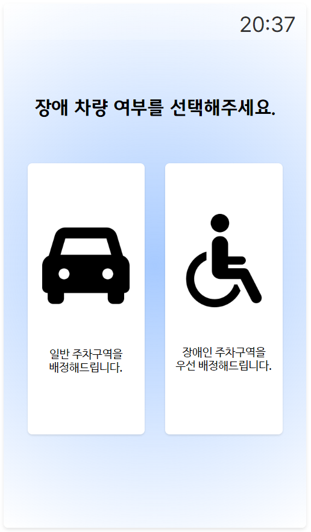 | 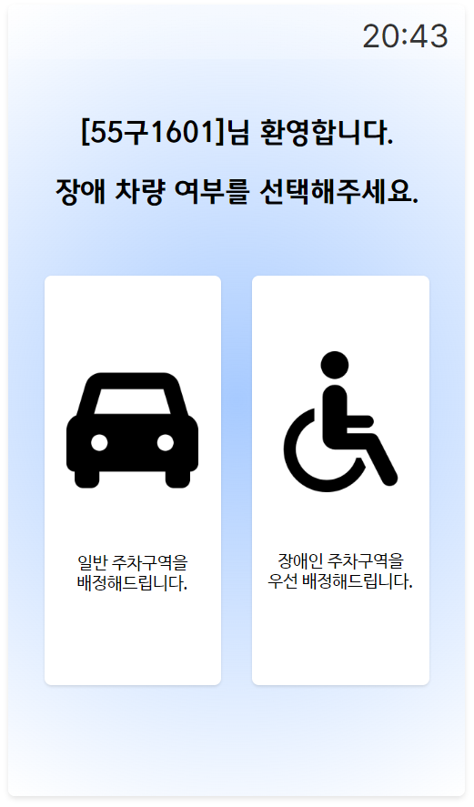 | 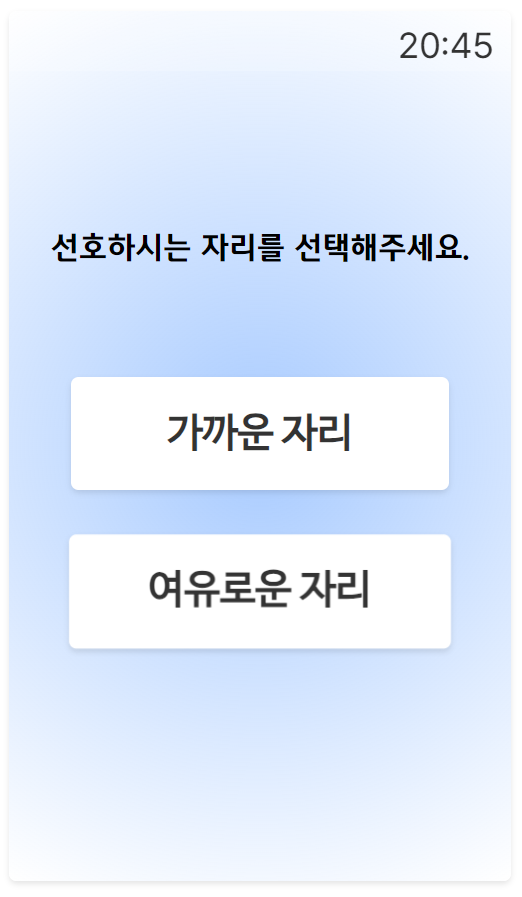 | 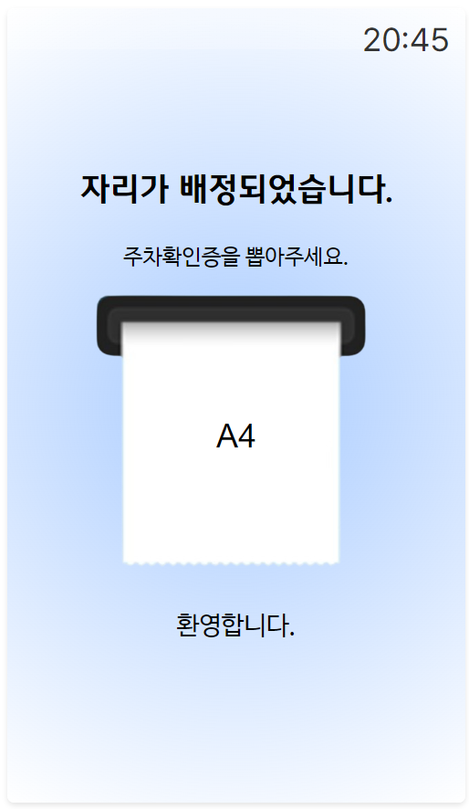 |

|                         번호 인식 에러                          |                             자리없음                              |
| :-------------------------------------------------------------: | :---------------------------------------------------------------: |
| 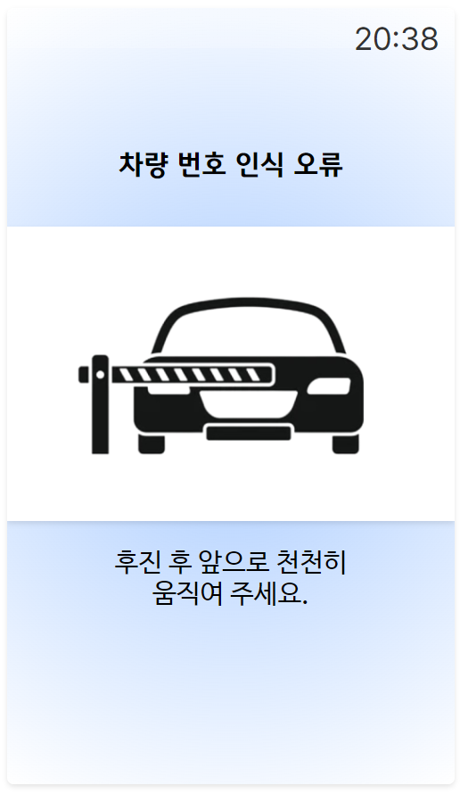 | 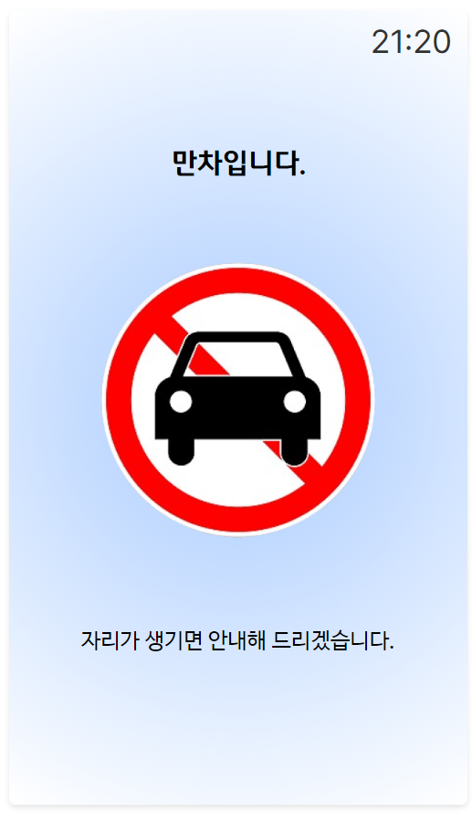 |

### admin

|                             로그인                             |                              대쉬보드                              |                              신고기록                              |
| :------------------------------------------------------------: | :----------------------------------------------------------------: | :----------------------------------------------------------------: |
|  | 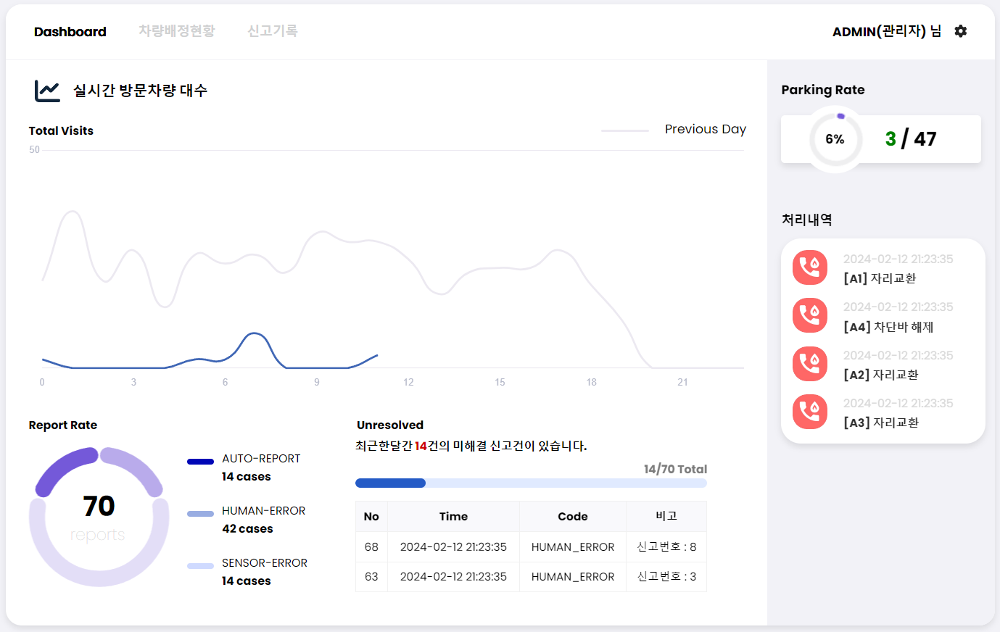 | 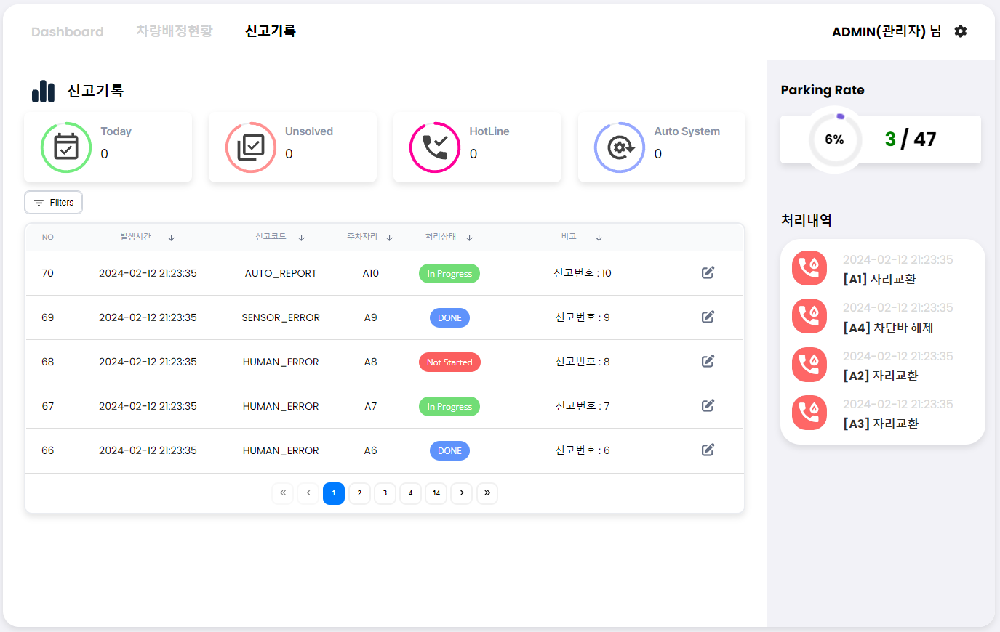 |

|                                차량현황                                 |                                자리변경                                 |                              자리 차단바 해제                               |
| :---------------------------------------------------------------------: | :---------------------------------------------------------------------: | :-------------------------------------------------------------------------: |
| 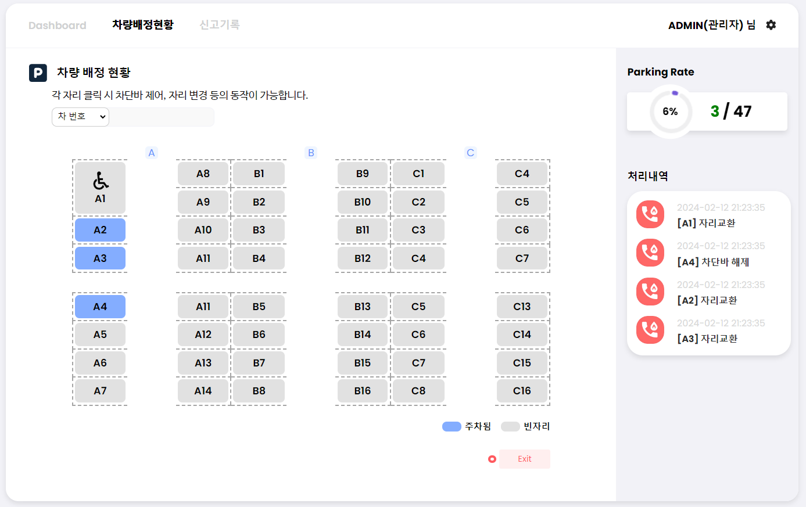 | 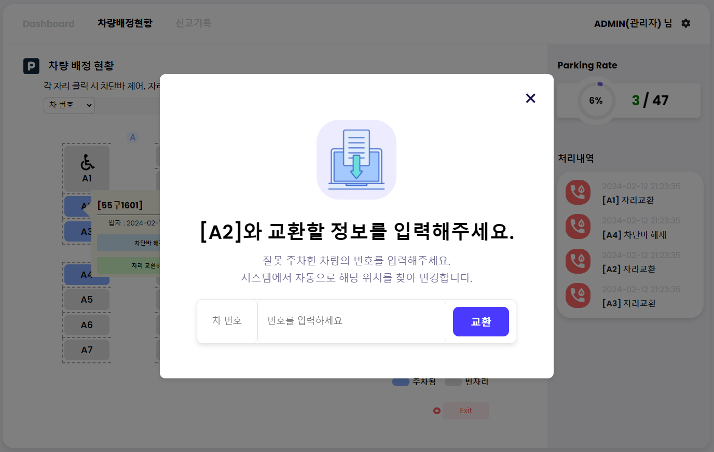 | 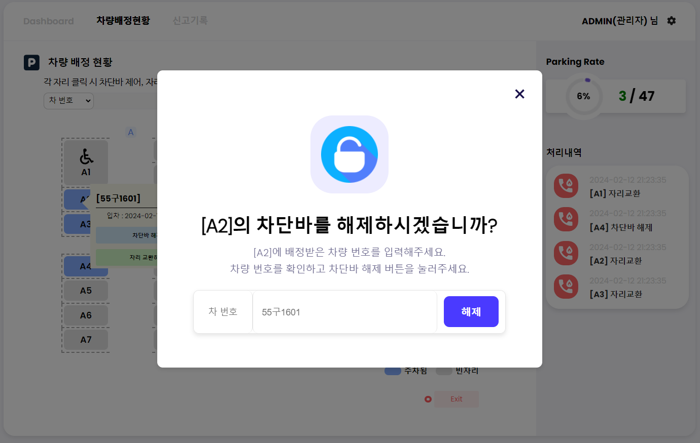 |

### 제작품

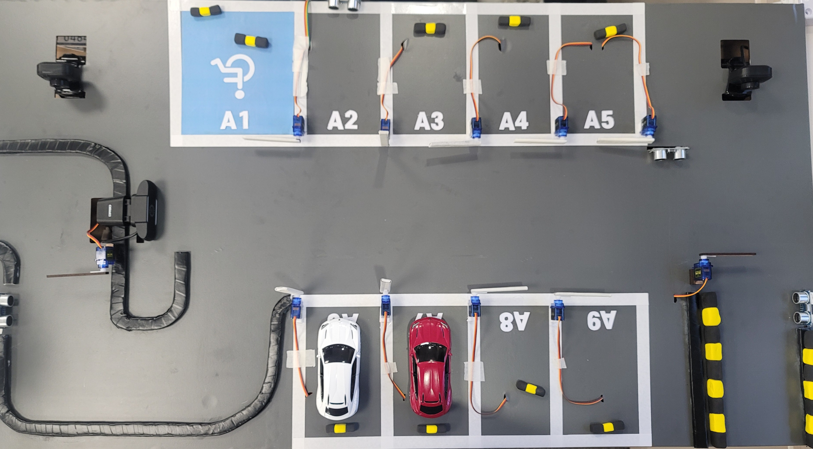

### ERD

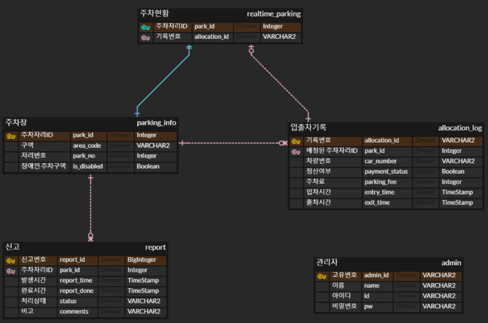

## 팀 구성

|       백성욱        | 김용준  | <center>김준호</center> |  박수형  |  임태수  |       최서현        |
| :-----------------: | :-----: | :---------------------: | :------: | :------: | :-----------------: |
| Leader <br> Backend | Backend |        FrontEnd         | Hardware | Hardware | Backend <br> Design |

### 역할분배

---

#### 백성욱

- 팀장
- 로그인 및 비밀번호 수정 기능 구현
- 로그인 및 비밀번호 수정 페이지 구현
- CI / CD
- 중간 발표
- 도메인 생성
- 라우터 가드 구현
- https 구현

#### 김용준

- 차량 자리 배정 로직, 구역 판별 로직 구현
- 신고 기록 조회 및 수정 API, 관리자 신고 페이지 구현
- 키오스크에서 배정 정보 프린터로 인쇄하는 기능
- Gerrit 및 Gitlab Git flow 환경 구축
- 시스템 아키텍처, 시퀀스 다이어그램 작성
- 관리자 차량 관리 툴팁 구현

#### 김준호

- 프론트 엔드 컴포넌트 설계
- 키오스크 프론트엔드
  - 주차구역 선택 페이지 구현
    - 비장애인, 장애인 주차구역 선택 페이지
    - 여유, 가까운 자리 선택 페이지
  - 만차 페이지 구현
  - 재촬영 페이지 구현
  - 자리 배정 페이지 구현
- UI/UX 설계
- 중간 발표 PPT 제작

#### 박수형

- 시연품 제작
- 시연품 제어 코드 작성
- AI server 구축 / 배포

#### 임태수

- 시연품 제작
- 시연품 회로 설계
- 시연품 제어 코드 작성
- UCC 제작

#### 최서현

- 최종발표
- 관리자페이지, 키오스크의 SSE 실시간 업데이트 구현
- 대시보드 및 차트 API 및 프론트엔드 구현
- 공통바, 플로팅알림 등 프론트엔드 구현
- 차번호 검증, 자동신고시스템, 차단바 해제 등
  장고 ↔ 스프링간 통신 API 구현
- DB 및 엔티티설계
- UI/UX 피그마 디자인
- THE 노션 문서화 마스터
- 스크럼로그 관리
- 백엔드 JPA 코드 컨벤션 작성

## 🛠기술스택

### BackEnd

&nbsp;
&nbsp;
&nbsp;
&nbsp;
&nbsp;

- Java JDK 21
- SpringBoot 3.2.2
- JPA
- Gradle
- MySQL 8.0.35
- Django

### FrontEnd

&nbsp;
&nbsp;
&nbsp;
&nbsp;

- Vue
- Node.js
- javascript
- Axios

### HardWare

&nbsp;
&nbsp;
&nbsp;
&nbsp;

- Raspberry Pi4 B 6.1
- Arduino IDE 2.2.1
- Python 3.9.13
- AutoCAD

### CI/CD

&nbsp;
&nbsp;
&nbsp;
&nbsp;
&nbsp;

- AWS EC2
- Ubuntu 20.04 LTS
- nginx
- Docker
- Jenkins

### 협업 툴

&nbsp;
&nbsp;
&nbsp;
&nbsp;
&nbsp;

- Git
- Jira
- Mattermost, Notion
- Figma
- gerrit

## 프로젝트 파일 구조

<details>
<summary>backend</summary>
<div markdown="1">

```
📦 backend
│  📂 bin
│  │  📂 main
│  │     📜 application-production.properties
│  │     📜 application.properties
│  │     📂 static
│  │        📜 admin.html
│  │        📜 admin.js
│  │        📜 kiosk.html
│  │        📜 kiosk.js
│  📜 build.gradle
│  📜 dummy.txt
│  📂 gradle
│  │  📂 wrapper
│  │     📜 gradle-wrapper.jar
│  │     📜 gradle-wrapper.properties
│  📜 gradlew
│  📜 gradlew.bat
│  📜 settings.gradle
│  📂 src
│     📂 main
│     │  📂 java
│     │  │  📂 com
│     │  │     📂 hana
│     │  │        📂 chagokchagok
│     │  │           📜 ChagokchagokApplication.java
│     │  │           📂 contoller
│     │  │           │  📜 AdminController.java
│     │  │           │  📜 GuestController.java
│     │  │           │  📜 ParkController.java
│     │  │           │  📜 SseController.java
│     │  │           📂 dto
│     │  │           │  📜 AllocationDto.java
│     │  │           │  📜 ErrorDto.java
│     │  │           │  📜 ParkingInfoDto.java
│     │  │           │  📜 ProcessingDetailDto.java
│     │  │           │  📜 ReportDataDto.java
│     │  │           │  📜 ReportDto.java
│     │  │           │  📜 ReportRateDto.java
│     │  │           │  📂 request
│     │  │           │  │  📜 AllocateCarRequest.java
│     │  │           │  │  📜 CarNumRequest.java
│     │  │           │  │  📜 ChangePasswordRequest.java
│     │  │           │  │  📜 ExchangeRequest.java
│     │  │           │  │  📜 GetCarlocRequest.java
│     │  │           │  │  📜 LoginRequest.java
│     │  │           │  │  📜 LogoutRequest.java
│     │  │           │  │  📜 OpenBarRequest.java
│     │  │           │  │  📜 PullOutRequest.java
│     │  │           │  │  📜 ReportRequest.java
│     │  │           │  │  📜 SearchInfoRequest.java
│     │  │           │  │  📜 ValidateAreaRequest.java
│     │  │           │  📂 response
│     │  │           │  │  📜 AllocateCarResponse.java
│     │  │           │  │  📜 CarNumValidationDto.java
│     │  │           │  │  📜 ChangePasswordDto.java
│     │  │           │  │  📜 CommonAlertResponse.java
│     │  │           │  │  📜 DashBoardResponse.java
│     │  │           │  │  📜 GetCarlocResponse.java
│     │  │           │  │  📜 LoginResponse.java
│     │  │           │  │  📜 LogoutResponse.java
│     │  │           │  │  📜 RealtimeCarsResponse.java
│     │  │           │  │  📜 RealTimeParkingInfoResponse.java
│     │  │           │  │  📜 RefreshTokenResponse.java
│     │  │           │  │  📜 ReportResponse.java
│     │  │           │  │  📜 SearchInfoResponse.java
│     │  │           │  │  📜 ValidateAreaResponse.java
│     │  │           │  📜 UnresolvedDto.java
│     │  │           │  📜 ValidationParkingInfoDto.java
│     │  │           📂 entity
│     │  │           │  📜 Admin.java
│     │  │           │  📜 AllocationLog.java
│     │  │           │  📜 ParkingInfo.java
│     │  │           │  📜 RealtimeParking.java
│     │  │           │  📜 Report.java
│     │  │           📂 enums
│     │  │           │  📜 ErrorCode.java
│     │  │           │  📜 ReportStatus.java
│     │  │           │  📜 SearchType.java
│     │  │           │  📜 SseStatus.java
│     │  │           📂 exception
│     │  │           │  📜 CustomException.java
│     │  │           │  📜 ErrorResponse.java
│     │  │           │  📜 ErrorType.java
│     │  │           │  📜 InvalidInputException.java
│     │  │           │  📜 SpotNotEmptyException.java
│     │  │           │  📜 SseEmitterIsNullException.java
│     │  │           │  📜 UnAuthorizedException.java
│     │  │           📂 repository
│     │  │           │  📜 AdminRepository.java
│     │  │           │  📜 AllocationLogRepository.java
│     │  │           │  📜 ParkingInfoRepository.java
│     │  │           │  📜 RealtimeParkingRepository.java
│     │  │           │  📜 ReportRepository.java
│     │  │           📂 service
│     │  │           │  📜 AdminService.java
│     │  │           │  📜 DjangoClient.java
│     │  │           │  📜 FeignService.java
│     │  │           │  📜 GuestService.java
│     │  │           │  📜 ParkService.java
│     │  │           │  📜 SseService.java
│     │  │           📂 util
│     │  │              📜 DjangoClientConfig.java
│     │  │              📜 GlobalExceptionHandler.java
│     │  │              📜 JwtInterceptor.java
│     │  │              📜 JWTUtil.java
│     │  │              📜 P6SpyFomatter.java
│     │  │              📜 SeparateLocation.java
│     │  │              📜 SHA256.java
│     │  │              📜 ValidateCarNum.java
│     │  │              📜 WebConfiguration.java
│     │  📂 resources
│     │     📜 application-production.properties
│     │     📜 application.properties
│     │     📜 password.properties
│     │     📂 static
│     │        📜 admin.html
│     │        📜 admin.js
│     │        📜 kiosk.html
│     │        📜 kiosk.js
│     📂 test
│        📂 java
│           📂 com
│              📂 hana
│                 📂 chagokchagok
│                    📜 ChagokchagokApplicationTests.java

```

</div>
</details>

<details>
<summary>frontend</summary>
<div markdown="1">

```
📦 frontend
│  📂 chagokchagok
│  │  📜 .env
│  │  📜 index.html
│  │  📜 jsconfig.json
│  │  📜 package-lock.json
│  │  📜 package.json
│  │  📂 public
│  │  │  📜 favicon.ico
│  │  │  📂 icon
│  │  │     📜 BarChart.png
│  │  │     📜 Doorbell.png
│  │  │     📜 hotline.png
│  │  │     📜 sensor.png
│  │  📜 README.md
│  │  📂 src
│  │  │  📂 api
│  │  │  │  📜 admin.js
│  │  │  📜 App.vue
│  │  │  📂 assets
│  │  │  │  📜 base.css
│  │  │  │  📜 disabled_icon.png
│  │  │  │  📜 exchange_car_image.png
│  │  │  │  📜 favicon.ico
│  │  │  │  📜 font.css
│  │  │  │  📜 logo.svg
│  │  │  │  📜 main.css
│  │  │  │  📜 NotoSansKR-Regular.ttf
│  │  │  │  📜 unlock_bar.png
│  │  │  │  📜 주차안내 이미지 1.png
│  │  │  │  📜 주차안내 이미지 2.png
│  │  │  │  📜 주차안내 이미지 3.png
│  │  │  │  📜 주차안내 이미지 4.png
│  │  │  │  📜 주차확인증.png
│  │  │  📂 components
│  │  │  │  📂 admin
│  │  │  │  │  📜 AppCommonBar.vue
│  │  │  │  │  📜 AppFloatingAlert.vue
│  │  │  │  │  📜 AppPageHeader.vue
│  │  │  │  │  📂 modal
│  │  │  │  │  │  📜 HomeView.vue
│  │  │  │  │  │  📜 ModalBar.vue
│  │  │  │  │  │  📜 ModalChange.vue
│  │  │  │  │  │  📜 ModalDetailReport.vue
│  │  │  │  │  📜 navbar.vue
│  │  │  │  │  📂 report
│  │  │  │  │  │  📜 ReportCountBar.vue
│  │  │  │  │  │  📜 ReportList.vue
│  │  │  │  │  📜 ReportChart.vue
│  │  │  │  │  📜 Search.vue
│  │  │  │  │  📜 Tooltip2.vue
│  │  │  │  📂 guest
│  │  │  │  │  📜 dummy.txt
│  │  │  │  📜 HelloWorld.vue
│  │  │  │  📂 icons
│  │  │  │  │  📜 CarGuest.vue
│  │  │  │  │  📜 IconCommunity.vue
│  │  │  │  │  📜 IconDocumentation.vue
│  │  │  │  │  📜 IconEcosystem.vue
│  │  │  │  │  📜 IconExit.vue
│  │  │  │  │  📜 IconMainBlue.vue
│  │  │  │  │  📜 IconMainWhtite.vue
│  │  │  │  │  📜 IconSupport.vue
│  │  │  │  │  📜 IconTooling.vue
│  │  │  │  │  📜 MdiIcon.vue
│  │  │  │  │  📜 MdiIconButton.vue
│  │  │  │  │  📜 QuestionBubble.vue
│  │  │  │  📂 kiosk
│  │  │  │  │  📜 dummy.txt
│  │  │  │  📂 layout
│  │  │  │  │  📜 AppLocation.vue
│  │  │  │  │  📜 AppLocationGuest.vue
│  │  │  │  │  📜 AppPagination.vue
│  │  │  │  │  📜 AppSection.vue
│  │  │  │  │  📜 AppSectionGuest.vue
│  │  │  │  │  📜 AppSectionMiddle.vue
│  │  │  │  │  📜 AppSectionMiddleGuest.vue
│  │  │  │  │  📜 ReportCountCard.vue
│  │  │  │  📂 main
│  │  │  │     📜 ChangePassword.vue
│  │  │  │     📜 LoginPage.vue
│  │  │  │     📜 test.vue
│  │  │  📜 main.js
│  │  │  📂 plugins
│  │  │  │  📜 webfontloader.js
│  │  │  📂 router
│  │  │  │  📜 index.js
│  │  │  📂 stores
│  │  │  │  📜 admin.js
│  │  │  │  📜 alert.js
│  │  │  │  📜 dashboard.js
│  │  │  │  📜 guest.js
│  │  │  │  📜 parkingSectionStore.js
│  │  │  │  📜 parkingStore.js
│  │  │  │  📜 report.js
│  │  │  📂 utils
│  │  │  │  📜 http-status.js
│  │  │  │  📜 mainAxios.js
│  │  │  📂 views
│  │  │     📂 admin
│  │  │     │  📜 DashBoard.vue
│  │  │     │  📜 ParkingSection.vue
│  │  │     📜 Admin.vue
│  │  │     📂 guest
│  │  │     │  📜 dummy.txt
│  │  │     │  📜 GuestView.vue
│  │  │     📜 HomeView.vue
│  │  │     📂 kiosk
│  │  │     │  📜 AllocationScreen.vue
│  │  │     │  📜 ChoiceScreen.vue
│  │  │     │  📜 NoplaceScreen.vue
│  │  │     │  📜 Print.vue
│  │  │     │  📜 RecognitionErrorScreen.vue
│  │  │     │  📜 RecommendationScreen.vue
│  │  │     📜 Main.vue
│  │  📜 vite.config.js
│  📜 package-lock.json
```

</div>
</details>

<details>
<summary>hardware</summary>
<div markdown="1">

```
📦 hardware
│  📂 client
│  │  📜 arduino.py
│  │  📜 clinet.py
│  │  📜 entrance_client.py
│  │  📜 exit_hall_client.py
│  │  📂 image
│  │  │  📜 image1.jpg
│  │  │  📜 image2.jpg
│  │  │  📜 image3.jpg
│  │  │  📜 image4.jpg
│  │  │  📜 image5.jpg
│  │  │  📜 image_io.jpg
│  │  📜 requirements.txt
│  📂 server
│     📂 aiserver
│     │  📜 asgi.py
│     │  📜 settings.py
│     │  📜 urls.py
│     │  📜 wsgi.py
│     │  📜 __init__.py
│     📂 apiv1
│     │  📜 admin.py
│     │  📜 apps.py
│     │  📂 migrations
│     │  │  📜 __init__.py
│     │  📜 models.py
│     │  📜 tests.py
│     │  📜 urls.py
│     │  📜 utils.py
│     │  📜 views.py
│     │  📜 __init__.py
│     📜 Dockerfile
│     📜 image.png
│     📜 lp_det.pt
│     📂 lp_models
│     │  📂 models
│     │  │  📜 best_acc.pth
│     │  │  📜 craft_mlt_25k.pth
│     │  📂 user_network
│     │     📜 best_acc.py
│     │     📜 best_acc.yaml
│     │     📜 transformation.py
│     📜 manage.py
│     📜 requirements.txt
│     📜 server-requirements.txt
│     📜 SpoqaHanSansNeo-Light.ttf
│     📜 yolov5s.pt
```

</div>
</details>

## 시스템 아키텍쳐


### [API 명세서](https://www.notion.so/API-416d1c418006414d8b8912dfdab97391?pvs=4)

### **팀의 코드 컨벤션**

[커밋 컨벤션](./conventions/commit_convention.md)

[[BE] 코드컨벤션](./conventions/backend_convention.md)

[[FE] 코드컨벤션](./conventions/frontend_convention.md)

[[H/W] 코드컨벤션](./conventions/hw_convention.md)
