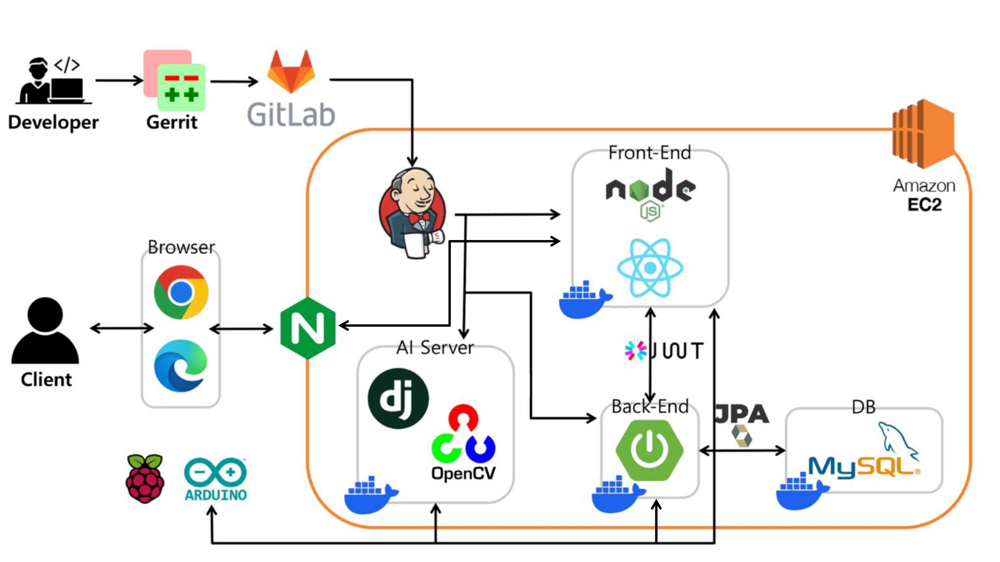

# README.md

### 서비스 소개

> 주차장에서 돌고 도는 당신을 위한 자동 주차 배정 시스템,
> 🚗차곡차곡🚗

## 팀 구성

|                                        백성욱                                        |                                         김용준                                         |                               
김준호
                                |                                         박수형                                         |                                         임태수                                         |                                          최서현                                          |
| :----------------------------------------------------------------------------------: | :------------------------------------------------------------------------------------: | :----------------------------------------------------------------------------------: | :------------------------------------------------------------------------------------: | :------------------------------------------------------------------------------------: | :--------------------------------------------------------------------------------------: |
|  |  |  |  |  |  |
|                                     팀장   BE                                     |                                           BE                                           |                                  FE팀장   UX/UI                                   |                                         HW팀장                                         |                                           HW                                           |                                    BE팀장   UX/UI                                     |

## kiosk

|                               메인                               |                               차량인식                                |                                자리선택                                |                            주차자리 배정                            |
| :--------------------------------------------------------------: | :-------------------------------------------------------------------: | :--------------------------------------------------------------------: | :-----------------------------------------------------------------: |
|  |  |  |  |

|                         번호 인식 에러                          |                             자리없음                              |
| :-------------------------------------------------------------: | :---------------------------------------------------------------: |
|  |  |

## admin

|                             로그인                             |                              대쉬보드                              |                              신고기록                              |
| :------------------------------------------------------------: | :----------------------------------------------------------------: | :----------------------------------------------------------------: |
|  |  |  |

|                                차량현황                                 |                                자리변경                                 |                              자리 차단바 해제                               |
| :---------------------------------------------------------------------: | :---------------------------------------------------------------------: | :-------------------------------------------------------------------------: |
|  |  |  |

## ERD

### 엔티티 구조

**(1) 주차장 ↔ 주차현황**

- 일대일 단방향 연관관계 (주차현황쪽이 외래키를 가짐)

**(2) 주차현황 ↔ 입출차기록**

- 일대일 단방향 연관관계 (주차현황쪽이 외래키를 가짐)

**(3) 주차장 ↔ 입출차기록**

- 일대다 단방향 연관관계 (입출차기록쪽이 외래키, 즉 다)

**(4) 주차장 ↔ 신고**

- 일대다 단방향 연관관계 (신고기록쪽이 외래키, 즉 다)

## 시스템 아키텍쳐

### [API 명세서](https://www.notion.so/API-416d1c418006414d8b8912dfdab97391?pvs=4)

### **팀의 코드 컨벤션**

[커밋 컨벤션](./conventions/commit_convention.md)

[[BE] 코드컨벤션](./conventions/backend_convention.md)

[[FE] 코드컨벤션](./conventions/frontend_convention.md)

[[H/W] 코드컨벤션](./conventions/hw_convention.md)
